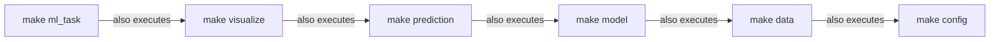

# Instructions for the GA Workshop 


### 1. Set up VPN 
See instructions sent over via email a few days ago:
1. Download VPN client [here](https://www.eduvpn.org/client-apps).
2. Launch client and log in with your guest account.
3. If you have any errors, find solutions [here](https://faq.tickets.tu-dresden.de/otrs/public.pl?Action=PublicFAQZoom;ItemID=1284).

### 2. Open JupyterLab
- use the following link: copy/paste it into an **incognito/private browser window**:
https://jupyterhub.hpc.tu-dresden.de/hub/spawn#/~(cluster~'capella~nodes~'1~ntasks~'1~cpuspertask~'14~mempercpu~'2048~gres~'gpu*3a1~runtime~'05*3a30*3a00~reservation~'p_scads_trainings_85~project~'p_scads_trainings)
- login with your guest account
- in some browsers you will get this message, click 'ok'.
  


### 3. Open Terminal, located in the main area.


### 4. Type or copy/paste the following commands:
```
cd # ensure you're in home directory
ws_allocate -F horse AE-ws 10
ws_register -F horse $HOME
cd $HOME/horse/$USER-AE-ws/
git clone -b ga-workshop https://github.com/jan-forest/autoencodix
chmod +x autoencodix/install-kernel.sh
```

### 5. Navigate to autoencodix directory
In the left sidebar, you will find the file browser. Here you are in your `$HOME` directory. 
Navigate to (click on) horse/autoencodix and open `install-kernel-script.ipynb`.


### 6. Run the install-kernel-script.ipynb notebook.


### 7. Follow the instructions indicated in the output.  

# Troubleshooting:
If, for any reason, you would like to respawn JupyterLab, click: File -> Hub Control Panel -> Stop My Server
To close your session. Then use the link above in 2. to respawn.


### 1. `Error: could not create workspace directory!`

If you are encountering this error, please follow the instructions indicated [here](https://doc.zih.tu-dresden.de/data_lifecycle/workspaces/?h=workspace#faq-and-troubleshooting). 


### 2. My JupyterLab session stopped!

Use the link above in 2. to respawn.

### 3. Failing to spawn using the link provided.

You are most likely automatically logged in using your own ZIH credentials and not the ones provided by the workshop instructors for the day. Open an incognito tab and copy paste the link provided in 2. Then use the login credentials provided in the email sent a few days back. 


# AUTOENCODIX

Autoencoders are deep-learning based networks for dimension reduction and embedding by a combination of compressing encoder and decoder structure for non-linear and multi-modal data integration with promising application to complex biological data from large-scale omics measurements. Current ongoing research and publication provide many exciting architectures and implementations of autoencoders. However, there is a lack of easy-to-use and unified implementation covering the whole pipeline of autoencoder application.
Consequently, we present `AUTOENCODIX` with the following features:
- Multi-modal data integration for any numerical or categorical data
- Different autoencoder architectures:
  - vanilla `vanillix`
  - variational `varix`
  - hierarchical/stacked `stackix`
  - ontology-based `ontix`
  - cross-modal autoencoder (translation between different data modalities) `x-modalix`
- A customizable set-up, run with your own data and change model parameters in a `yaml` configuration file
- Full pipeline from preprocessing to embedding evaluation: 


For a detailed description and benchmark of capabilities, check our preprint and publication here: [bioRxiv 10.1101/2024.12.17.628906](https://doi.org/10.1101/2024.12.17.628906 ) 

Please, use this to cite our work when using our framework: 

```
@article {autoencodix2024,
	author = {Joas, Maximilian and Jurenaite, Neringa and Pra{\v s}{\v c}evi{\'c}, Du{\v s}an and Scherf, Nico and Ewald, Jan},
	title = {A generalized and versatile framework to train and evaluate autoencoders for biological representation learning and beyond: AUTOENCODIX},
	year = {2024},
	doi = {10.1101/2024.12.17.628906},
	journal = {bioRxiv}
}
```
 

# Table of contents
  
- [AUTOENCODIX](#autoencodix)
- [Table of contents](#table-of-contents)
  * [1 INSTALLATION](#1-installation)
    + [1.1 Linux-based](#11-linux-based)
    + [1.2 Windows-based](#12-windows-based)
    + [1.3 Mac OS](#13-mac-os)
    + [1.4 HPC Cluster](#14-hpc-cluster)
  * [2 Getting started](#2-getting-started)
    + [2.1 First steps and tutorials](#21-first-steps-and-tutorials)
    + [2.2 Other pipeline examples](#22-other-pipeline-examples)
    + [2.3 Working with own data and config files](#23-working-with-own-data-and-config-files)
  * [3 Run and edit pipeline](#3-run-and-edit-pipeline)
  * [4 Project Organization](#4-project-organization)
  * [5 Output files and visualization](#5-output-files-and-visualization)
  * [6 Running with GPU support and parallelization on HPC](#6-running-with-gpu-support-and-parallelization-on-hpc)
  * [7 Archives old runs](#7-archives-old-runs)
  * [8 References](#8-references)
  * [9 FAQ](#9-faq)
    + [Reproducibility and CUBLAS_WORKSPACE_CONFIG](#reproducibility-and-cublas-workspace-config)
  * [10 Contributing](#10-contributing)
  

## 1 INSTALLATION

  

Follow the instructions depending on the machine you are working with. For familiarisation with the code, use your local machine on a small dataset as shown in our tutorials.

Requirements:
- pip
- Python == 3.10 (support for Python >=3.10 starting soon)
- GPU recommended for larger datasets
  

### 1.1 Linux and MacOS
- clone this repo:
```bash
git clone https://github.com/jan-forest/autoencodix.git
```

- change into the repo:
```bash
cd autoencodix
```

- Create environment with:
```bash
make create_environment
```

- activate environemnt with:
```bash
source venv-gallia/bin/activate
```

- install requirements with:
```bash
make requirements
```

- currently GPU support is not available for MacOS

  

### 1.2 Windows-based
- to use the Makefile in Windows you need to install `make`

- See https://linuxhint.com/run-makefile-windows/

- Move `Makefile_windows` to `Makefile`

- create environment with: `make create_environment`

- activate env with `.\venv-gallia\Scripts\activate`

- install requirements with `make requirements`

- if you encounter problems, see the troubleshooting section at the [end](#9-faq)
  

### 1.4 HPC Cluster

- clone this repo in a dedicated space you want to decide to work in

- load Python/3.10 or above and virtualenv

- create a Python virtual environment according to your HPC guidelines

- activate the environment with `source [env-name]/bin/activate`

- install requirements with `make requirements`


  

## 2 Getting started

### 2.1 First steps and tutorials

To work with our framework, only three steps are necessary: 
1. Get the input data ready
2. Specify model and pipeline parameter via a `<run_id>_config.yaml`-config file
3. Run the full pipeline via `make RUN_ID=<run_id>` 

First time users should check our tutorial notebooks for more details on those steps and showcases of important options of `AUTOENCODIX`:
- [Quick Start with a small X-Modalix use-case](Tutorials/Quick_Start.ipynb)
- [Framework set-up and input data preparation](Tutorials/Setup_InputFormat.ipynb)
- [Basic config specification and VAE training](Tutorials/Basics_Autoencodix.ipynb)
- [Working with single-cell data and AUTOENCODIX](Tutorials/Basics_single-cell.ipynb)
- [Example of an ontology-based VAE providing explainability](Tutorials/Advanced_Ontix.ipynb)
- [Showcase of cross-modal VAE for translation of gene expression to images](Tutorials/Advanced_Xmodalix.ipynb)


### 2.2 Other pipeline examples

Additional to tutorial notebooks, we provide example configs of main features of `AUTOENCODIX`:
- Multi-modal VAE training on TCGA pan-cancer data `run_TCGAexample.sh` including hyperparameter tuning with [Optuna](https://github.com/optuna/optuna) via:
```
> ./bash-runs/run_TCGAexample.sh 
```
- Training of an ontology-based VAE `ontix` on single-cell data via: 
```
> ./bash-runs/run_SingleCellExample.sh 
```
All scripts will download the data, create necessary `yaml`-configs and run the pipeline for you. Results and visualizations can be found under `reports/<run_id>/`.
 

### 2.3 Working with own data and config files

To work with our framework you first need to make sure that it has following format as described in details in the [tutorial](Tutorials/Setup_InputFormat.ipynb):
- for each data modality either a text-file (`csv`,`tsv`,`txt`) or `.parquet`-file with samples as rows and features as columns
- we recommend an `ANNOTATION`-file in the same format containing clinical parameter or other sample meta-data for visualization
- As described in the tutorials provide ontologies or image-mapping files to work with [`ontix`](Tutorials/Advanced_Ontix.ipynb) or [`x-modalix`](Tutorials/Advanced_Xmodalix.ipynb)

When your input data is ready, you need to create your own config with the name `<run_id>_config.yaml`.
We provide a sample config in `./_config.yaml`. Copy and rename this file:

```

> cp ./_config.yaml ./<RUN_ID>_config.yaml

```
Each entry in the `_config.yaml` has an inline comment that indicates whether you:
- Have to change this parameter (flagged with `TODO`)
- Should think about this parameter (flagged with `SHOULDDO`)
- probably don't need to change this parameter (flagged with `OPTIONAL`)

All config parameters are explained in the `_config.yaml` file directly and the full documentation, [here](ConfigParams.md).
  

  
## 3 Run and edit pipeline
There are multiple steps in the pipeline. The steps can be run all at once, or step by step. To run the whole pipeline it is sufficient to run `make ml_task RUN_ID=<run-id>`.

If you only want to run all steps up until model training, you can run `make model RUN_ID=<run-id>`. This will prepare the data structure, process the data, and train your models. It is also possible to run steps without running the steps before. This can be done by the `_only` suffix. i.e. `make model_only RUN_ID=<run-id>`.



After you have run the pipeline including `make data` and you want to make changes to model training parameters, you can re-run the pipeline with `make train_n_visualize RUN_ID=<run-id>`. This will skip data preprocessing and is useful is some cases when adjusting training parameters. 


## 4 Project Organization

```
|-- bash-runs
|   |-- run_slurm.sh
|   |-- run_SingleCellExample.sh
|   |-- run_TCGAexample.sh
|-- data
|   |-- interim
|   |-- processed
|   |   |-- <RUN_ID>
|   |   |   |-- <data1.txt>
|   |   |   |-- <data2.txt>
|   |   |   `-- sample_split.txt
|   |-- raw
|   |   |-- <raw_data.txt>
|   |   |-- images
|   |   |   |---image_mappings.txt
|   |   |   |---image1.jpg
|-- models
|   |-- <RUN_ID>
|       `-- <model.pt>
|-- reports
|   |-- <RUN_ID>
|   |    |--<latent_space.txt>
|   |    |--figures
|   |       `--<figure1.png>
|-- src
|   |-- data
|   |   |-- format_sc_h5ad.py
|   |   |-- format_tcga.py
|   |   |-- join_h5ad.py
|   |   |-- join_tcga.py
|   |   |-- make_dataset.py
|   |   `-- make_ontology.py
|   |-- features
|   |   |-- build_features.py
|   |   |-- combine_MUT_CNA.py
|   |   `-- get_PIscores.py
|   |-- models
|   |   |-- tuning
|   |   |   |-- models_for_tuning.py
|   |   |   |-- tuning.py
|   |   |-- build_models.py
|   |   |-- main_translate.py
|   |   |-- models.py
|   |   |-- predict.py
|   |   `-- train.py
|   |-- utils
|   |   |-- config.py
|   |   |-- utils.py
|   |   `-- utils_basic.py
|   |-- visualization
|   |   |-- Exp2_visualization.py
|   |   |-- Exp3_visualization.py
|   |   |-- ml_task.py
|   |   |-- vis_crossmodalix.py
|   |   `-- visualize.py
|   |-- 000_internal_config.yaml
|-- ConfigParams.md
|-- LICENSE
|-- Makefile
|-- Makefile_macos
|-- README.md
|-- TCGAexample_config.yaml
|-- TuningExample_config.yaml
|-- _config.yaml
|-- clean.sh
|-- requirements.txt
|-- scExample_config.yaml
|-- setup.py
|-- test_environment.py

```


## 5 Output files and visualization

Running our pipeline will create as output multiple visualizations, latent space and reconstruction data frames and save PyTorch-models. 
Output can be found here: 
- `reports/<run_id>/` with visualizations and data frames of latent space (sample embeddings), loss metrics over epochs and other reports
- `models/<run_id>/` PyTorch-model of final model as well as checkpoint-models if specified in the config.   
- `data/processed/<run_id>/` all preprocessed input data and sample split file are stored.  

## 6 Running with GPU support and parallelization on HPC
The whole pipeline will automatically run on GPUs if GPUs are available (via `torch.cuda.is_available()` and using device `cuda:0`).

See our `run_slurm.sh` script for a sample slurm configuration with GPU. To run on an HPC cluster, you need to adjust the `run_slurm.sh` script with your paths. and then start the script like:

```
> bash ./bash-runs/run_slurm.sh <you-run-id>
```
This will send the sbatch script to your cluster. This way you can also easily parallelize multiple runs, by generating multiple config files.


## 7 Archives old runs
We provide a clean script, `clean.sh`. The script either archives or deletes all folders of the given run id(s):
- data/processed
- data/interim
- models
- reports
Run by:
```
> ./clean.sh -r <ID1,ID2,ID3,...,IDn>
```
will archive all output and interim data under `archive` as `<run_id>.zip`-files. If you want to delete, use the option `-d`. If you want to keep only the report folder and delete or archive the other, use the option `-k`.

## 8 References

For a more detailed benchmark of `AUTOENCODIX` check our preprint and publication under: https://www.biorxiv.org/
The implementation of autoencoder architectures is based and inspired by work of following authors and publications: 
- For `vanillix` and `varix`: https://github.com/edianfranklin/autoencoder_for_cancer_subtype 
- For `varix` and `stackix`: https://github.com/CancerAI-CL/IntegrativeVAEs 
- Ontology-based VAE `ontix` with sparse decoder: 
  - VEGA https://github.com/LucasESBS/vega/tree/main
  - OntoVAE https://github.com/hdsu-bioquant/onto-vae 
  - expiMap https://github.com/theislab/expiMap_reproducibility 
- cross-modal autoencoder `x-modalix`:
  - https://github.com/uhlerlab/cross-modal-autoencoders

Used data sets in notebooks and examples
- TCGA via cbioportal https://www.cbioportal.org/datasets 
- pre-processed single-cell data via https://cellxgene.cziscience.com/ 
  - in particular multiome RNA and ATAC-Seq data set of human cortex development https://doi.org/10.1126/sciadv.adg3754 
- MNIST handwritten digits via KERAS https://keras.io/api/datasets/mnist/ 
- Images and proteom data of *C. elegans* embryogenesis https://doi.org/10.1038/s41592-021-01216-1 


## 9 FAQ

### Reproducibility and CUBLAS_WORKSPACE_CONFIG
If you run for reproducibility with `FIX_RANDOMNESS: "all"` and you receive the following error:
```
RuntimeError: Deterministic behavior was enabled with either `torch.use_deterministic_algorithms(True)` or `at::Context::setDeterministicAlgorithms(true)`, but this operation is not deterministic because it uses CuBLAS and you have CUDA >= 10.2. 
```
You need to run the following in your terminal before running our pipeline: 
```
export CUBLAS_WORKSPACE_CONFIG=:16:8
```

### Windows make requirements
If you run into the following error on Windows (Powershell):
```
error: Microsoft Visual C++ 14.0 or greater is required"
```
You can find solutions in this [thread](https://stackoverflow.com/questions/64261546/how-to-solve-error-microsoft-visual-c-14-0-or-greater-is-required-when-inst)

## 10 Contributing
Contributions are highly welcome, please check your [guide](https://github.com/jan-forest/autoencodix/blob/main/CONTRIBUTING.md)

